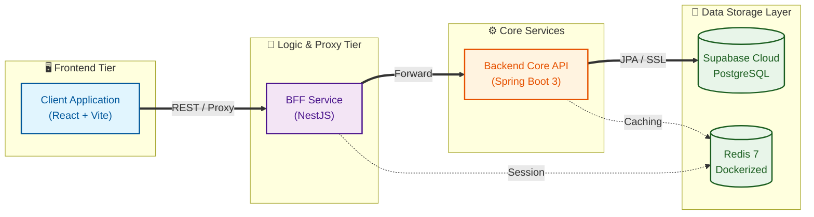
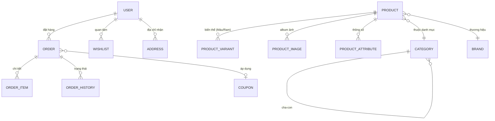
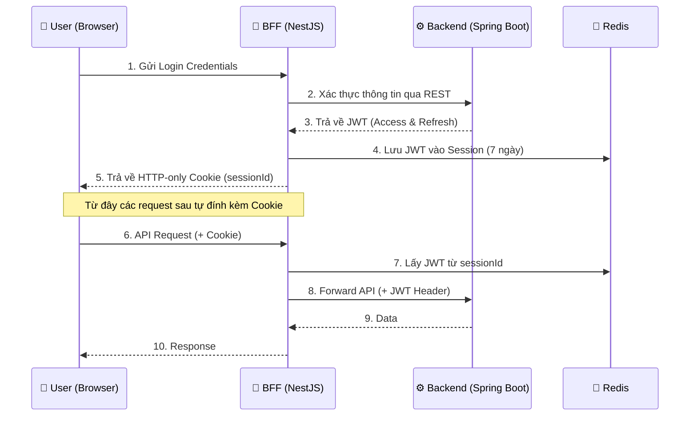

# 📊 Tech Store V2 - Phân Tích Hệ Thống Toàn Diện

## 🏗️ Kiến Trúc Tổng Quan (System Architecture)

Dự án **Tech Store V2** là một hệ thống thương mại điện tử chuyên biệt cho linh kiện công nghệ, được kiến trúc theo mô hình **BFF (Backend for Frontend)** hiện đại, giúp tối ưu hóa giao tiếp giữa giao diện và các dịch vụ nền tảng.

---

## 📂 Chi Tiết Các Lớp (Layer Details)

### 1. Backend Core — Spring Boot 3.2.4 (Java 17)

Lớp lõi xử lý toàn bộ nghiệp vụ doanh nghiệp (Business Logic) và quản lý dữ liệu.

| Thành phần | Vai trò | Chi tiết |
|:---|:---|:---|
| **Controller** | API Gateways | 18+ domains (auth, product, order, cart, chat, coupon...) |
| **Service** | Business Logic | Xử lý logic phức tạp, tích hợp thanh toán, quản lý kho. |
| **Entity** | JPA/ORM | Ánh xạ 19+ bảng cơ sở dữ liệu với quan hệ phức tạp. |
| **Security** | Auth & Guard | JWT stateless, OAuth2, Rate Limiting (Bucket4j). |
| **Integrations** | 3rd Party | VNPay (Thanh toán), Cloudinary (Hình ảnh), Gemini (AI Chat). |

**Cấu hình Performance:**
*   **Database:** Hiện đang sử dụng **Supabase Transaction Pooler (Port 6543)** để tối ưu kết nối.
*   **Hibernate:** Batching enabled (50 inserts/batch) để xử lý dữ liệu lớn.
*   **Security:** JWT Access (15m), Refresh (7d).
*   **Monitoring:** Tích hợp Actuator & Prometheus.

### 2. BFF Layer — NestJS 11 (TypeScript)

Đóng vai trò là lớp trung gian điều phối và bảo mật cho Frontend.

*   **Quản lý Session**: Sử dụng Redis để lưu trữ session JWT (7 ngày).
*   **Smart Proxy**: Chuyển tiếp yêu cầu đến Backend, tự động đính kèm token bảo mật.
*   **Caching**: Tích hợp cơ chế cache GET requests (TTL 60s) để giảm tải cho Backend.
*   **Security**: Chặn các cuộc tấn công Brute-force qua Rate limiting trung tâm.

### 3. Frontend — React 18 & Modern UI

Giao diện người dùng được tối ưu cho hiệu năng cao và trải nghiệm mượt mà.

| Feature | Tech Stack |
|:---|:---|
| **Styling** | Tailwind CSS 3 & Framer Motion (Animations) |
| **3D Engine** | Three.js + React Three Fiber (3D Product Viewer) |
| **State Mgmt** | Redux Toolkit (11 slices quản lý trạng thái) |
| **UI Components** | Lucide React, Recharts (Charts), SweetAlert2 |

---

## 🔐 Mô Hình Thực Thể (Data Model)

Dưới đây là sơ đồ quan hệ giữa các thực thể chính trong hệ thống:

---

## 💰 Các Module Nghiệp Vụ Chính

*   **🛒 E-commerce Core**: Quản lý sản phẩm đa biến thể (Variants), kho hàng (Inventory), và quy trình đơn hàng 5 bước.
*   **💳 Thanh toán**: Tích hợp VNPay Sandbox với xử lý IPN an toàn.
*   **🎫 Khuyến mãi**: Hệ thống Coupon linh hoạt (theo %, số tiền cố định, giới hạn sử dụng).
*   **🤖 AI Integration**: Chatbot thông minh hỗ trợ tra cứu đơn hàng và tư vấn sản phẩm.
*   **🛡️ Security Audit**: Nhật ký đăng nhập và kiểm soát quyền hạn (RBAC) 5 cấp bậc.

---

## 🔑 Luồng Xác Thực (Authentication Flow)

Dự án sử dụng cơ chế **Cookie-based Session** ở phía Client và **JWT-based Auth** ở phía Backend để tối ưu bảo mật.

---

## 📊 Thống Kê Dự Án

*   **Quy mô**: ~150+ tệp nguồn trên 3 nền tảng khác nhau.
*   **Hạ tầng**: Toàn bộ hệ thống có thể chạy qua Docker Compose với 5 dịch vụ chính.
*   **Độ sẵn sàng**: **Production-Ready**. Đã xử lý 100% cảnh báo biên dịch và tích hợp cơ sở dữ liệu Cloud (Supabase).

> [!IMPORTANT]
> **Trạng thái hiện tại (May 2026):** Codebase đã được dọn dẹp sạch sẽ, cấu hình SSL cho DB Cloud đã hoàn tất. Hệ thống sẵn sàng để triển khai (Deploy) lên các nền tảng như Railway, Vercel hoặc AWS.

---
*Tài liệu này được cập nhật tự động bởi Antigravity AI.*
